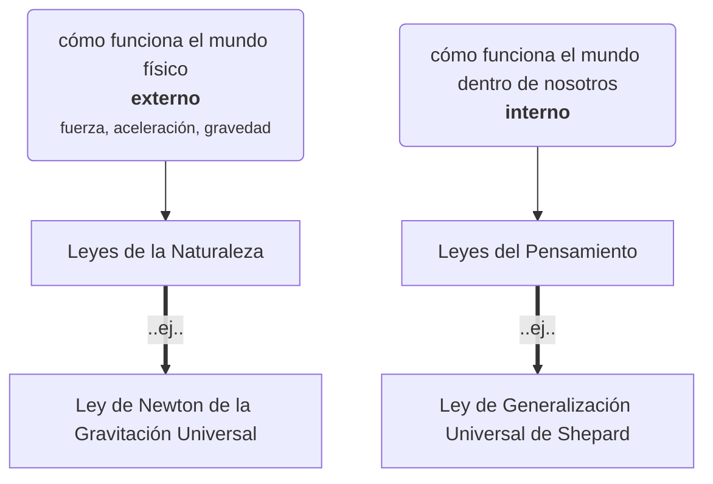

```mermaid
flowchart TB
  how("cómo funciona el mundo físico<br/><b>externo</b><br/><small>fuerza, aceleración, gravedad</small>")
  nat[Leyes de la Naturaleza]
  Newton[Ley de Newton de la Gravitación Universal]
  ins("cómo funciona el mundo dentro de nosotros<br/><b>interno</b>")
  th[Leyes del Pensamiento]
  Shepard[Ley de Generalización Universal de Shepard]
how-->nat==..ej..==>Newton
ins-->th==..ej..==>Shepard
```

